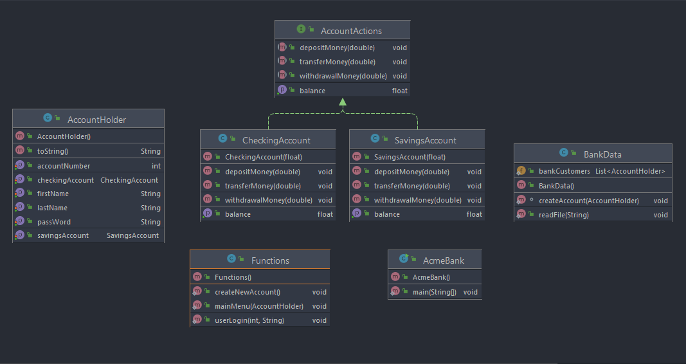

# java-project-1

Description:

Basic banking application for "Acme Bank"

User stories:

Bronze level:

As a user I want to be able to sign up for an account to manage my bank account.

As a user I want to be able to create a login name and password.  

As a user I want to be able to create a checking account (savings account). 

As a user I want to log into my account to check my (checking account balance, savings account balance, transfer funds, withdraw funds from checking/savings). 

Silver level:

As a user I want to be able to log into my account to deposit funds into my checking/savings account. 

As a user I want to be able to log into my account to transfer funds between my checking and savings account. 

As a user I want to be able to log into my account to transfer funds to another user’s account. 

As a bank I want to charge a customer an overdraft protection fee of $35 when over drafting. 

As a bank I want to prevent the customer from withdrawing more than $100 USD  if account is currently negative. (The account cannot have a resulting balance of less than $100 OR the customer cannot make a withdrawal of greater than $100). 

As a bank I want to deactivate any account after 2 over drafts. (Reactivate the account if the customer brings the account current, paying both the over draft amount and the resulting over draft fees. 

Gold level:

As a user I want to be able to view my transaction data (create another file to store the transaction history, required login). 

•	Index all transactions for a customer account. 

•	Show one transaction details

•	Show historical data of transactions (date and time of transaction, type of transaction, resulting balance, etc). 

As a user I want my checking account to pull from my savings account if my checking account doesn’t have enough funds (if available). 
Send notification if balance hits zero/negative. 

Build storyline:

Originally I had planned to build each part of this project in a "top to bottom" fashion, however it became apparent that this was not the best plan of action. I then built out most of the necessary Java classes putting in the necessary basics (i.e. the initial methods, getters and setters, Objects and such).
I had planned to build the intended functionalities along side their respective methods, but after a fellow classmate recommended a functions class, it was apparent that this was a much more efficient way to build the program.
I was then able to create the needed methods and functionality in one "streamlined" location. This also became easier after a one on one where we took my mostly functional code and organized it into a more efficient form.
This was Wednesday morning and stressing about the "mostly functional" part. Once things were in order, the second half of Wednesday was very productive and I was able to build out probably 95% of my functionality. 
Thursday was spent finishing out some additional required functionality and then the plan was to move on to additional silver and potentially gold functions. After finishing the create new user/write file function that mostly worked (Checking and Savings amounts were written as disk storage location), I started getting a runtime error. Spent way too much time trying to resolve the issue. My research into the error didn't lead to any resolve as what I was seeing in my code didn't match the examples I was finding. It was after mentioning the error to a fellow classmate (that previously had the same issue), that I was able to resolve it. 
The issue was caused by the write file code creating an extra blank line in the .txt file. The issue of the balance amounts appearing as disk location was due to a small piece of missing code. Adding this piece of code also fixed the issue with the empty lines in the .txt file so I've got that going for me, which is nice.

Strategy:

After building out the majority of the classes and methods I needed to build out the functions. Through research my intention was to use switch statements, however I ended up using multiple if/else if and nested if/else if statements to build the menus, submenus and functionality. 
The current functionality allows for account creation, add funds, withdraw funds, transfer funds between checking/savings. Since we are not using a GUI, I built out the navigation functionality by using a select numbered option interface.

Things discovered:

Extensive nested if/else if or switch statements can become easy to get lost in.

Learned about static Scanners after building out almost all of my scanners. 

"Top to bottom" program creation is not always the best strategy.

Things to work on:

Transfer between accounts functionality.

Overdraft functionality. 

Ability to accrue interest in the savings account.

Fee for transferring funds between users.

Transaction/history log.

Resources:

Oracle.com

baeldung.com

tutorialspoint.com

geeksforgeeks.org

javapoint.com

stackoverflow.com

youtube.com

medium.com

ERD diagram:

